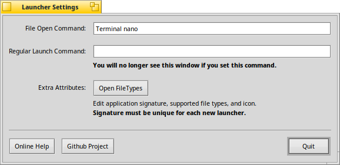

## Now Open


_Now Open_ is a reusable application launcher for [Haiku](https://haiku-os.org/) which is capable of opening files
using non-native or command line applications.  The launcher will appear in the standard `Open with...` menu and
`FileTypes` application allowing you to set it as the default handler when opening these types of files from `Tracker`
and other applications.

***Instructions for building and creating launchers can be found in the [wiki](../../wiki)***



### Build Instructions

```
~> cd NowOpen
~/NowOpen> jam
```

Use `jam predefined` to build several predefined launchers.
The built launchers will be available in the `obj.X86` directory.

*After the build finishes you may need to run the launcher once(and possibly reboot) for it to show up in the Haiku
`Open with...` menu or `FileTypes` application*
